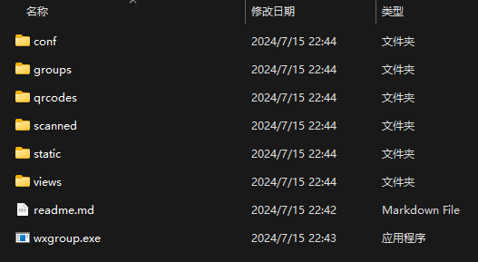
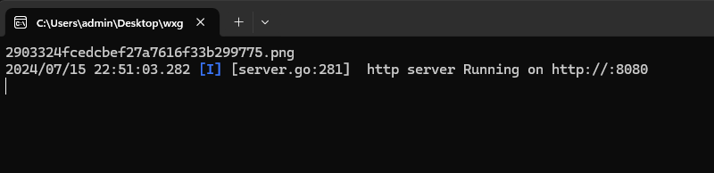

# 随机提取二维码

一款方便个人用来随机提取二维码进行扫码的小工具。

## 背景

有很多二维码，准备分享给很多人去扫，为了避免大家扎堆按默认的顺序去扫，特开发了这款随机提取二维码的小工具。

## 使用指南

这个工具很简单，代码也很 low, 面向搜索引擎现学现开发的，够用就行。

根据个人的操作系统，下载 windows 或 unix 版本的包，下载完成后，解压缩到任意目录即可。

得到如下目录结构：(这里以 windows 为例)



将下载下来的二维码图片放置到 groups 目录（有目录或文件夹也没关系，会遍历所有文件夹）下。

双击 wxgroup.exe 会打开一个终端窗口，不要关闭这个窗口。



打开浏览器，或者直接点击下方的链接：

http://localhost:8080/group

这时，groups 中的图片都会转移至 qrcodes 目录下，命名方式是 图片的MD5值.png

这时，需要关闭刚才的终端窗口，重新打开。

重新打开后，不要关闭窗口，再访问下面的链接即可通过网页不断自动刷新二维码了。

http://localhost:8080


每次刷新二维码，就表示当前的二维码已经扫过了，会被转移至 scanned 目录，如果需要重新扫码，可以关闭终端窗口，将二维码再放回 qrcodes 目录下，重新打开终端，刷新浏览器页面即可。

## 开发指南

本项目基于最简单的 beego 框架进行开发，比较简单。

参考文档： https://beego.wiki/zh-cn/docs/install/bee/

```shell
# go 1.16及以后的版本
go install github.com/beego/bee/v2@latest

# 执行
bee run

# 打包
bee pack
```

手动构建

```shell
go mod tidy

GOOS=windows GOARCH=amd64 go build -o wxgroup.exe
GOOS=linux GOARCH=amd64 go build -o wxgroup_amd
GOOS=linux GOARCH=arm64 go build -o wxgroup_arm
GOOS=darwin GOARCH=amd64 go build -o wxgroup_mac_amd
GOOS=darwin GOARCH=arm64 go build -o wxgroup_mac_arm
```

